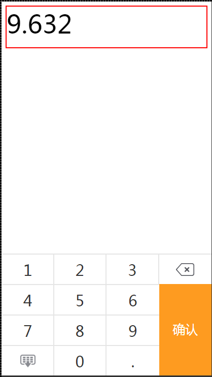

# keyBoardNum
移动端数字键盘插件，该插件依赖于zepto或者jquery，主要是为了解决ios默认系统键盘无法调出小数点的问题
## 效果图

## 使用方法  
在页面中引入zepto或者jquery
```javascript
<script type="text/javascript" src="zepto.min.js"></script>
```
然后引入keyboardNum(页面中的css已经全部打包在js中了，无需引用css)
```javascript
<script type="text/javascript" src="keyboardNum.js"></script>
```
两个文件引入之后就可以初始化键盘了
```javascript
var key = new KeyBoardNum('#input',{
    decimal:5,
    integer:3,
    btnCallBack:function(num){
        console.log(num);
    }
});
key.show();
//也支持链式调用
var key = new KeyBoardNum('#input',{
    decimal:5,
    integer:3,
    btnCallBack:function(num){
        console.log(num);
    }
}).show();
```

## 参数说明
KeyBoradNum接受两个参数：

1、第一个参数：显示输入的数字的元素(支持一切合法的元素选择类型)，这个元素不能是input或者textarea

2、第二个参数option，一个对象，其属性如下

| 属性名称 | 属性说明 | 默认值 |
| ------------- |:-------------| :-----|
| itemHeight | 一个数字键的高度 | 60 |
|decimal|允许的小数点长度| 2 |
|integer|允许的整数部分长度| 4 |
|fontSize|数字字体大小|'30px'|
|color|数字的颜色|'#333'|
|bgColor|背景颜色|'#fff'|
|borderColor|边框颜色|'#E5E5E5'|
|activeColor|键盘被点击时的背景颜色|'#ebebeb'|
|btnText|按钮显示的文字|'确认'|
|btnColor|按钮文字的颜色|'#fff'|
|btnFontSize|按钮文字大小|'70px'|
|btnBgColor|按钮的背景颜色|'#bcbcbc'|
|btnActiveBgColor|按钮激活的背景颜色|'#fe9b20'|
|btnTouchBgColor|按钮激活后被点击时的背景颜色|'#e27d00'|
|btnCallBack|按钮点击后的回调|null|
|delImg|删除按钮图片|默认值以base64形式存储在js中|
|hideImg|隐藏按钮图片|默认值以base64形式存储在js中|
